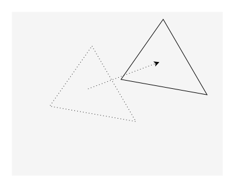
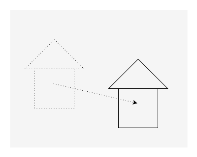
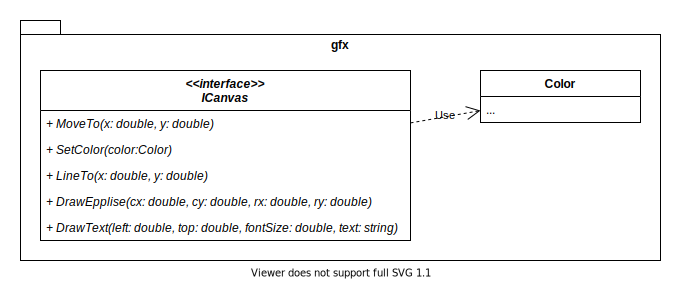

# Лабораторная работа №1. Паттерн «Стратегия»

- [Лабораторная работа №1. Паттерн «Стратегия»](#лабораторная-работа-1-паттерн-стратегия)
  - [Критерии оценивания лабораторной работы](#критерии-оценивания-лабораторной-работы)
  - [Задание 1 — учим птиц танцевать (30 баллов)](#задание-1--учим-птиц-танцевать-30-баллов)
  - [Задание 2 — добавляем состояние к стратегии (30 баллов)](#задание-2--добавляем-состояние-к-стратегии-30-баллов)
  - [Задание 3 — функциональный стиль (50 баллов)](#задание-3--функциональный-стиль-50-баллов)
  - [Задание 4 — Программа с фигурами](#задание-4--программа-с-фигурами)
    - [4.1 Базовый функционал](#41-базовый-функционал)
      - [Команда `AddShape`](#команда-addshape)
        - [Окружность (circle)](#окружность-circle)
        - [Прямоугольник (rectangle)](#прямоугольник-rectangle)
        - [Треугольник (triangle)](#треугольник-triangle)
        - [Отрезок прямой (line)](#отрезок-прямой-line)
        - [Текст (text)](#текст-text)
      - [Команда MoveShape](#команда-moveshape)
      - [Команда MovePicture](#команда-movepicture)
      - [Команда DeleteShape](#команда-deleteshape)
      - [Команда List](#команда-list)
      - [Команда ChangeColor](#команда-changecolor)
      - [Команда ChangeShape](#команда-changeshape)
      - [Команда DrawShape](#команда-drawshape)
    - [4.2 Бонус за наличие тестов](#42-бонус-за-наличие-тестов)

## Критерии оценивания лабораторной работы

- На оценку «удовлетворительно» необходимо набрать 50 баллов.
- На оценку «хорошо» необходимо набрать 100 баллов.
- На оценку «отлично» необходимо набрать 150 баллов.

## Задание 1 — учим птиц танцевать (30 баллов)

Доработайте программу SimUDuck, научив уток танцевать с использованием
паттерна «Стратегия». MallardDuck умеет танцевать вальс, а RedHeadDuck
-- менуэт. Искусственные утки танцевать не умеют.

## Задание 2 — добавляем состояние к стратегии (30 баллов)

Доработайте программу SimUDuck таким образом, чтобы утки, умеющие
летать, вели учет количества вылетов и выводили порядковый номер своего
вылета в stdout. Примечание: от утки не требуется помнить число вылетов
после смены стратегии полёта.

## Задание 3 — функциональный стиль (50 баллов)

Напишите версию приложения SimUDuck, в которой паттерн «Стратегия» используется в функциональном стиле. Должен быть реализован функционал танцев уток и счётчика полётов.

## Задание 4 — Программа с фигурами

### 4.1 Базовый функционал

Напишите консольную программу Shapes, в которой можно создавать композицию из различных геометрических фигур. Композиция создаётся при помощи команд, поступающих со стандартного потока ввода:

#### Команда `AddShape`

Добавляет фигуру. Синтаксис команды:

```txt
AddShape <id> <цвет> <тип> <параметры>
```

- `<id>` — строка, задающая идентификатор фигуры. Идентификатор используется для управления фигурой в последующих командах.
- `<цвет>` — строка в формате `#RRGGBB`, задающая цвет фигуры, где `R`, `G`, `B` - цифры шестнадцатеричной системы счисления. Например `#FFff00` задаёт жёлтый цвет.
- `<тип>` — задаёт тип фигуры. У каждой фигуры свой набор параметров.
- `<параметры>` — одно или несколько значений, разделённых пробелами, задающих параметры создаваемой фигуры.

Например, следующая команда добавляет окружность розового цвета с id, равным `sh1`, с центром в точке (100, 110) и радиусом 15:

```txt
AddShape sh1 #ff00ff circle 100 110 15 
```

Если фигура с таким id уже существует, выдать сообщение об ошибке.

##### Окружность (circle)

Окружность задаётся координатами центра и радиусом. Все параметры — числа с плавающей запятой. Радиус должен быть неотрицательным.

```txt
circle <x> <y> <r>
```

##### Прямоугольник (rectangle)

Прямоугольник задаётся координатами верхнего левого угла, шириной и высотой. Все параметры — числа с плавающей запятой. Ширина и высота должны быть неотрицательными.

```txt
rectangle <left> <top> <width> <height>
```

##### Треугольник (triangle)

Треугольник задаётся координатами вершин. Все числа — параметры с плавающей запятой.

```txt
triangle <x1> <y1> <x2> <y2> <x3> <y3>
```

##### Отрезок прямой (line)

Отрезок прямой линии задаётся координатами начала и конца.

```txt
line <x1> <y1> <x2> <y2>
```

##### Текст (text)

Текст задаётся координатами левого верхнего угла, размером шрифта и текстом надписи. Координаты текста и размеры шрифта — числа с плавающей запятой. Текст — строка символов до конца строки.

```txt
text <left> <top> <размер> <тест>
```

Пример:

```txt
text 100.3 100.2 12.8 Hello world
```

#### Команда MoveShape

Сдвигает указанную фигуру вдоль вектора (dx, dy). dx и dy - числа с плавающей запятой. Размеры фигуры не изменяются. Синтаксис команды:

```txt
MoveShape <id> <dx> <dy>
```



#### Команда MovePicture

Сдвигает всю композицию вдоль вектора (dx, dy), как если бы команда MoveShape была применена ко всем фигурам композиции. dx и dy - числа с плавающей запятой. Синтаксис команды:

```txt
MovePicture <dx> <dy>
```



#### Команда DeleteShape

Удаляет фигуру с указанным id. Синтаксис команды.

```txt
DeleteShape <id>
```

Если фигуры с таким id не существует, выдать сообщение об ошибке.

#### Команда List

Выводит список фигур. Фигуры выводятся в порядке их добавления. Синтаксис команды:

```txt
List
```

Информация по каждой фигуре выводится в отдельной строке в следующем формате:

```txt
<номер фигуры> <тип> <id> <цвет> <параметры фигуры>
```

- `<номер фигуры>` — число начиная с 1
- `<цвет>` — выводится в формате `#RRGGBB`, где `R`, `G`, `B` — цифры шестнадцатеричной системы счисления. Регистр букв - на ваше усмотрение.

Пример:

```txt
1 circle circ1 #ff00ff 10.3 20.3 30
2 rectangle rect1 #ff00ff 10 20 35 45.5
3 triangle tr1 #ff00ff 0.5 23.5 10 25 35 11
4 line ln1 #ff00ff 0.5 23.5 10 25 35 11
5 text txt1 #000000 100.3 100.2 12.8 Hello world
```

#### Команда ChangeColor

Команда `ChangeColor` изменяет цвет фигуры. Синтаксис команды:

```txt
ChangeColor <id> <цвет>
```

Цвет указывается в том же формате, что и в команде `AddShape`.

#### Команда ChangeShape

Команда `ChangeShape` изменяет тип фигуры и её параметры. Цвет и id фигуры фигуры остаётся без изменения. Синтаксис команды:

```txt
ChangeShape <id> <тип> <параметры>
```

Тип и параметры фигуры указываются в том же формате, что в команде `AddShape`.

Следующие команды добавляют прямоугольник, а затем превращают его в окружность:

```txt
AddShape sh1 #ff0000 rectangle 10 20 30 40
ChangeShape sh1 circle 100 110 15 
```

Изменение типа фигуры не должно удалять старую фигуру и вставлять новую фигуру на её место, а изменять параметры существующей.
Это означает, что если в программе получить ссылку на фигуру, а потом изменить её тип, ссылка на оригинальную фигуру sh1 должна остаться валидной.

#### Команда DrawShape

Рисует фигуру с указанным id. Синтаксис команды:

```txt
DrawShape <id>
```

Ранее нарисованное изображение не стирается. То есть эффект команд DrawShape "накапливается"

Для рисования фигуры должны использовать интерфейс `gfx::ICanvas`. В этом интерфейсе должны быть методы, управляющие рисованием:

- `SetColor(Color c)`. Изменяет текущий цвет рисования.
- `MoveTo(double x, double y)`. Переставляет перо в точку с заданными координатами. Точка (x, y) становится текущей позицией рисования.
- `LineTo(double x, double y)`. Соединяет текущую позицию рисования отрезком прямой с точкой (x, y). Точка (x, y) становится текущей позицией рисования. Линия рисуется текущим цветом линии. Линия рисуется текущим цветом.
- `DrawEllipse(double cx, double cy, double rx, double ry)`. Рисует эллипс с центром в точке (cx, cy), rx - горизонтальный радиус, ry - вертикальный радиус. Эллипс рисуется текущим цветом.



Реализуйте этот интерфейс одним из предложенных способов:

- Графика выводится в окне. Реализацию оконной подсистемы выберите на своё усмотрение.
- Графика выводится в файл формата SVG. Формирование SVG реализуйте своими силами. Путь к файлу программа принимает через командную строку либо запрашивает при старте (на ваше усмотрение).
- Графика выводится в растровый файл, например PNG. Библиотеку для рисования растровых изображений и записи результата в файл выберите на своё усмотрение. Путь к файлу программа принимает через командную строку либо запрашивает при старте (на ваше усмотрение). Размеры растрового изображения можете использовать фиксированные, либо запрашивать у пользователя.

### 4.2 Бонус за наличие тестов

Бонус начисляется за покрытие