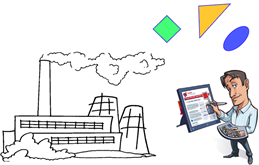
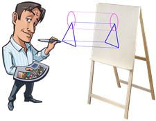
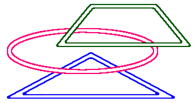

# Лабораторная работа №4. Паттерны «Фабрика» и «Фабричный метод»

- [Лабораторная работа №4. Паттерны «Фабрика» и «Фабричный метод»](#лабораторная-работа-4-паттерны-фабрика-и-фабричный-метод)
  - [Обязательные задания](#обязательные-задания)
    - [Задание 1 – Фабрика – 100 баллов](#задание-1--фабрика--100-баллов)
      - [Бонус 40 баллов за графическую визуализацию картины](#бонус-40-баллов-за-графическую-визуализацию-картины)
      - [Бонус 80 баллов за разработку приложения в стиле Test-driven development](#бонус-80-баллов-за-разработку-приложения-в-стиле-test-driven-development)

На оценку «удовлетворительно» необходимо набрать 80 баллов.

На оценку «хорошо» необходимо набрать 120 баллов.

На оценку «отлично» необходимо набрать 200 баллов.

Дополнительные задания принимаются только после выполнения обязательных заданий.

## Обязательные задания

### Задание 1 – Фабрика – 100 баллов

Прочитайте диалог действующих персонажей для погружения в предметную область.

Жил-был один клиент.

И был он страстным любителем живописи. Ходил постоянно по выставкам, любовался полотнами современных художников. И вот однажды, захотелось ему заиметь дома настоящую картину, чтобы любоваться ею.Вот только рисовать сам он не умел.

Решил он обратиться к профессиональному дизайнеру, чтобы тот нарисовал ему картину.А дизайнер ему и говорит: -Не вопрос. Какую скажете, любую картину нарисую. Вы, главное, сообщите, какие фигуры рисовать надо. Данные я принимаю через `istream`, одна строка – одна фигура.

Клиент спрашивает:-А какие фигуры можно использовать?

 А дизайнер ему отвечает:-Да какие угодно. Мне на фабрике какие угодно изготовят.

 Клиент:-А фигуры разноцветные?

 Дизайнер:-Разумеется! Есть 6 различных цветов: красный, зелёный, синий, розовый, жёлтый, черный.

 

Клиент:-Здорово! А в каком виде я получу картину?

Дизайнер:-Я дизайнер-универсал. Какой холст мне дадите, на таком и получите свою картину. Мне без разницы, на чем рисовать.

Клиент:-И даже в граните высечь сможете?

Дизайнер:-И высечь, и выпороть смогу. Главное, чтобы на «холсте» можно рисовать эллипсы и отрезки прямых, а также менять цвет пера.

Клиент:-Постойте! Если на холсте можно рисовать только эллипсы и отрезки прямых, то как быть, если я захочу нарисовать что-то более сложное? Вы же говорили, что я могу использовать произвольные фигуры.

Дизайнер:-А Вы внимательны! Действительно, к холсту требования довольно скромные. Вся магия заключена в фигурах. Дело в том, что каждая из них умеет рисовать свой образ на холсте, выполняя построение сложной фигуры из более простых.

|Клиент:-А сколько это будет стоить?

Дизайнер:-Все зависит от сложности рисунка. На изготовление каждой фигуры уходит материал, количество которого зависит от периметра фигуры. Плюс за свои услуги я беру фиксированную сумму за каждую фигуру в картине.

Клиент:-А рисование фигуры на холсте бесплатно?

Дизайнер:-Вообще-то на рисование тратится краска, количество которой пропорционально периметру фигуры. Впрочем, краска стоит гораздо дешевле, чем материал, из которого изготавливаются фигуры.

Клиент:-А если мне нужно несколько копий картины, получается слишком дорого. Пожалуй, мне придется отказаться от этой затеи с картинами.

Дизайнер:-Не волнуйтесь. Вы не единственный, кто обращается ко мне с этой просьбой. Я могу изготовить для вас макет вашей картины, на основе которого любой художник Вам сделает сколько угодно копий. Заплатите ему только за краску. Только запаситесь нужным количеством холстов.

|Клиент:-А что такое макет?

Дизайнер:-Это такая коробочка, в которой лежат в нужном порядке все фигуры, необходимые для рисования картины.

|Клиент:-А зачем нужен художник, почему бы самому макету не рисовать себя на холсте?

Дизайнер:-Да, я тоже думал об этом. Но решил не усложнять конструкцию макета, и отказался от этого функционала.

Ознакомьтесь с предложенной диаграммой классов. Укажите примеры применения принципа инверсии зависимостей, а также следствий их использования. Какие изменения Вы хотели бы внести в изображенную архитектуру приложения?

Разработайте основные классы, моделирующие основные сущности предметной области. Разработайте приложение, считывающее со стандартного потока ввода описания геометрических фигур, и формирующее на холсте соответствующее изображение (в простейшем случае – выводящее список примитивных команд в `stdout`).

#### Бонус 40 баллов за графическую визуализацию картины

Бонус начисляется за реализацию холста, позволяющую визуализировать картину клиента при помощи какого-нибудь графического API (на Ваш выбор). Альтернативный вариант – сгенерировать графический файл (растровый или векторный, который можно просмотреть в браузере или просмотрите картинок (bmp, svg));

#### Бонус 80 баллов за разработку приложения в стиле Test-driven development

Бонус начисляется за разработку классов фигур, клиента, дизайнера, фабрики, макета и художника в стиле TDD. Как принцип инверсии зависимостей способствует выполнению данной задачи?
