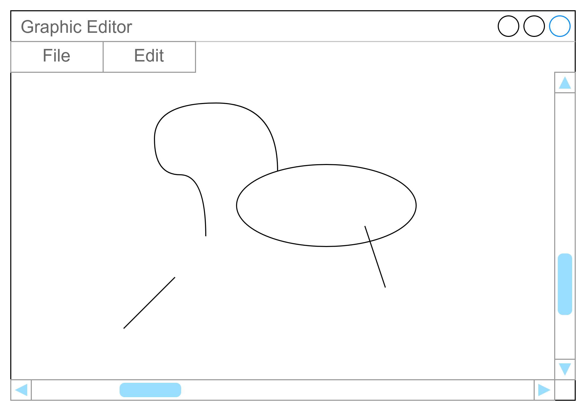

# **Лабораторная работа №10. Паттерн «MVC/MVP/MVVM»**

- [**Лабораторная работа №10. Паттерн «MVC/MVP/MVVM»**](#лабораторная-работа-10-паттерн-mvcmvpmvvm)
  - [Критерии оценивания лабораторной работы](#критерии-оценивания-лабораторной-работы)
  - [Задание 1](#задание-1)
    - [Вариант 1 Визуализация графика гармонических функций – 100 баллов](#вариант-1-визуализация-графика-гармонических-функций--100-баллов)
      - [Бонус в 30 баллов за покрытие модели юнит-тестами](#бонус-в-30-баллов-за-покрытие-модели-юнит-тестами)
      - [Бонус в 50 баллов за возможность переключения между представлениями](#бонус-в-50-баллов-за-возможность-переключения-между-представлениями)
    - [Вариант 2 – 200 баллов](#вариант-2--200-баллов)
      - [Бонус за возможность отмены и повтора операций – 80 баллов](#бонус-за-возможность-отмены-и-повтора-операций--80-баллов)
      - [Бонус за возможность сохранения и загрузки документа в файл – 40 баллов](#бонус-за-возможность-сохранения-и-загрузки-документа-в-файл--40-баллов)
      - [Бонус за покрытие кода тестами – до 50 баллов](#бонус-за-покрытие-кода-тестами--до-50-баллов)
      - [Бонус за возможность вставки растровых изображений – до 100 баллов](#бонус-за-возможность-вставки-растровых-изображений--до-100-баллов)
      - [Бонус за множественное выделение фигур — 50 баллов](#бонус-за-множественное-выделение-фигур--50-баллов)
    - [Вариант 3 — 200 баллов](#вариант-3--200-баллов)
      - [Бонус за возможность сохранить изображение в файл формата PNG — 30 баллов](#бонус-за-возможность-сохранить-изображение-в-файл-формата-png--30-баллов)
      - [Бонус за возможность рисования прямых линий — до 30 баллов](#бонус-за-возможность-рисования-прямых-линий--до-30-баллов)
      - [Бонус за возможность рисования эллипсов — до 30 баллов](#бонус-за-возможность-рисования-эллипсов--до-30-баллов)
      - [Бонус за возможность отмены или повтора операций редактирования — до 100 баллов](#бонус-за-возможность-отмены-или-повтора-операций-редактирования--до-100-баллов)

## Критерии оценивания лабораторной работы

При сдаче лабораторной работы студент должен уметь ответить
на вопросы преподавателя насчёт используемых паттернов проектирования,
уметь изобразить схему паттерна на диаграмме классов,
а также **продемонстрировать диаграмму классов своего приложения**.

- На оценку «удовлетворительно» необходимо набрать 120 баллов.
- На оценку «хорошо» необходимо набрать 250 баллов.
- На оценку «отлично» необходимо набрать 350 баллов.

## Задание 1

Выполните один из предложенных вариантов заданий

### Вариант 1 Визуализация графика гармонических функций – 100 баллов

Разработайте с использованием паттерна MVC, MVP либо MVVM приложение с графическим интерфейсом пользователя,
визуализирующим график суммы гармонических колебаний определенных частот, фаз и амплитуд.
Пользователь может добавлять и удалять гармонические функции, а также редактировать значения их частоты,
фазы, амплитуды, а также осуществлять выбор гармонической функции (синус либо косинус).

При изменении параметров гармоники, удалении или добавлении график должен автоматически обновляться.

Можно использовать произвольный UI-фреймворк.

#### Бонус в 30 баллов за покрытие модели юнит-тестами

Бонус начисляется за разработку классов модели с использованием TDD-подхода.

#### Бонус в 50 баллов за возможность переключения между представлениями

Бонус начисляется за возможность переключения между представлениями (при помощи вкладок, либо при помощи радиокнопок)
значений функции в виде графика и в виде таблицы:

### Вариант 2 – 200 баллов

Разработайте приложение с использованием паттерна MVC, MVP или MVVM приложение, позволяющее создавать композицию
из геометрических фигур: прямоугольники, треугольники, эллипсы.

При помощи кнопок панели инструментов или меню пользователь может добавлять на холст соответствующие фигуры.
Добавляемая фигура с некоторыми изначальными размерами вставляется в позицию по-умолчанию (например, в центр).

При помощи мыши пользователь может выделить фигуру, нажав внутрь ее области. Например,
треугольник и эллипс можно выделить только внутри прямоугольника или эллипса.

Выделенная фигура имеет прямоугольную рамку выделения с маркерами изменения размеров.
Рамка выделенной фигуры с маркерами изменения размеров всегда должна отображаться
на самом верхнем слое, чтобы можно было изменять размеры и позицию фигуры даже когда
она перекрыта другими фигурами.
Нажатие на зону холста, свободную от фигур снимает выделение с текущей фигуры.

Пользователь может перемещать фигуры по холсту, таская их за внутреннюю область фигуры
или за рамку выделения, а также изменять размеры фигуры при помощи маркеров изменения размеров.
При наведении курсора на маркер изменения размеров, курсор должен менять свой внешний вид (как в PowerPoint и подобных программах).
Переместить объект за пределы холста должно быть невозможно.
Фигура при таскании должна быть "привязана" к курсору мыши:
позиция фигуры относительно курсора мыши должна оставаться постоянной.
Исключение допускается только если перемещение фигуры невозможно из-за её выхода за пределы холста.

Выделенную фигуру можно удалить с холста, нажав клавишу Delete на клавиатуре
либо соответствующую кнопку на панели инструментов (выбрав пункт меню).

При рисовании фигур или изменении размеров окна не должно происходить мерцания изображения (используйте двойную буферизацию).

Архитектура приложения должна позволять легко сделать так, чтобы один и тот же документ
можно было редактировать в нескольких окнах (как в PowerPoint - View->New Window).
При этом в каждом окне должно быть своё независимое выделение.
При реализации бонуса с Undo/Redo фигуры, затрагиваемые при отмене или повторе команд, должны выделяться
в текущем активном окне.
Смотрите, как это работает в PowerPoint, когда пользователь
открывает новое окно для редактирования текущего документа.

#### Бонус за возможность отмены и повтора операций – 80 баллов

Бонус начисляется за поддержку операций Undo и Redo для операций, изменяющий состояние документа.
При отмене операции удаления документа фигура должна восстанавливаться на том же слое с сохранением своих размеров и положения.

#### Бонус за возможность сохранения и загрузки документа в файл – 40 баллов

Бонус начисляется за возможность сохранения и загрузки документа в файле формата json, xml
или в ином человекочитаемом формате.
Должны быть реализованы операции Open, Save и Save As, ведущие себя привычным образом.

#### Бонус за покрытие кода тестами – до 50 баллов

Бонус начисляется за покрытие тестами основных классов программы, не связанных непосредственно с визуализацией.

#### Бонус за возможность вставки растровых изображений – до 100 баллов

Бонус начисляется за возможность вставки в документ растровых изображений (хотя бы в одном графическом формате).
Пользователь может управлять растровыми изображениями наравне с другими объектами холста – перемещать, ресайзить, удалять.
 После вставки изображения в документ оригинальный файл изображения использоваться программой не должен:
 пользователь может его удалить, переименовать или изменить.
 Это должно быть справедливо и при отмене/повторе операций вставки.
 **40% от максимума за базовую часть**

Если изображения нет на холсте (например, при отмене его вставки или удалении с холста),
изображение должно удаляться из оперативной памяти.
При появлении изображения на холсте (например, при повторе операции вставки или отмене операции удаления с холста),
изображение должно загружаться из временного хранилища, куда оно должно помещаться в момент первоначальной вставки в документ.
При удалении изображения с холста и из истории команд оно должно удаляться и из хранилища.
**40% от максимума при наличии Undo/Redo**

При сохранении документа файлы находящихся в нём изображений должны сохраняться рядом с ним (возможно, в подкаталог).
В самом файле документа должны храниться относительные пути к изображениям.
При загрузке документа изображения должны загружаться из файлов по путям, относительно файла документа.
Предусмотреть обработку ошибок работы с файлами. **20% от максимума**

#### Бонус за множественное выделение фигур — 50 баллов

Пользователь должен иметь возможность выделить несколько фигур, удерживая Ctrl.
При этом у каждой из выделенных фигур появляется своя рамка выделения.

Перемещение одной выделенной фигуры приводит к перемещению всех выделенных фигур.
Ресайз одной из выделенных фигур приводит к пропорциональному изменению размеров выделенных фигур.
При этом ограничения на минимальные размеры фигур не должны нарушаться.
Undo/Redo воздействует сразу на группу модифицированных фигур.

### Вариант 3 — 200 баллов

Разработайте приложение, позволяющее пользователю выполнять рисование растрового изображения
на подобие графического редактора MS Paint.

Базовая функциональность программы должна включать в себя следующие операции:

- Возможность открыть изображение в формате PNG
- Пользователь может рисовать инструментом "карандаш" (как в MS Paint)
- Возможность выбрать цвет рисования, используя стандартный инструмент выбора цвета
- Возможность создать новое изображение.
  При создании изображения программа должна спросить размеры изображения (ширина и высота)
- Если изображение не помещается внутрь окна приложения, должны отображаться скроллбары.

При рисовании фигур или изменении размеров окна не должно происходить мерцания изображения (используйте двойную буферизацию).

#### Бонус за возможность сохранить изображение в файл формата PNG — 30 баллов

В меню программы должны быть пункты "Save" и "Save As...",
при помощи которых пользователь может сохранить изображение в файл формата PNG.
Эта функция работает так же, как и в других программах:

- Пункт "Save" запрашивает имя файла только если файл ранее не был сохранён.
  При последующих вызовах сохраняет в существующий файл.
- Пункт "Save As..." запрашивает имя файла всегда.
- При закрытии документа или открытии нового программа должна спросить,
  не желает ли пользователь сохранить несохранённые изменения (Yes, No, Cancel),
  если документ был изменён после последнего сохранения.

#### Бонус за возможность рисования прямых линий — до 30 баллов

Пользователь должен иметь возможность нарисовать отрезок прямой линии,
выбрав соответствующий инструмент в меню, подобно тому, как это сделано
в программе MS Paint.

Нажатие левой кнопки мыши задаёт начальную точку отрезка. Отпускание задаёт конечную точку.
В промежуток времени между нажатием и отпусканием кнопки мыши пользователь может видеть
текущее положение отрезка прямой, соединяющего начальную точку с текущей.

#### Бонус за возможность рисования эллипсов — до 30 баллов

Пользователь должен иметь возможность нарисовать эллипс,
выбрав соответствующий инструмент в меню, подобно тому, как это сделано
в программе MS Paint.

Нажатие левой кнопки мыши задаёт начальную точку прямоугольника, ограничивающего область эллипса.
Отпускание левой кнопки мыши задаёт противоположную точку ограничивающего эллипс прямоугольника.
В промежуток времени между нажатием и отпусканием кнопки мыши пользователь может видеть
текущее положение эллипса.

#### Бонус за возможность отмены или повтора операций редактирования — до 100 баллов

При редактировании документа пользователь должен быть способен отменить
операции редактирования при помощи операций Undo и Redo.

Эта функция слегка изменяет работу механизма сохранения.
Теперь документ считается изменённым, если текущее состояние документа
не соответствует состоянию, при котором он был сохранён. Пример:

- Пользователь создал документ.
- Пользователь нарисовал эллипс. Документ считается изменённым.
- Пользователь сохранил документ. Документ считается сохранённым.
- Пользователь нарисовал линию. Документ считается изменённым.
  Если в этот момент попытаться закрыть документ, программа должна предложить сохранить его.
- Пользователь выбрал пункт Undo и отменил рисование линии.
  Документ считается сохранённым, так как его текущее состояние совпадает с тем, которое было сохранено.

Так как растровое изображение может занимать большой объем памяти,
примените оптимизацию, которая хранила бы только изменившиеся фрагменты изображения.
Например, разбейте изображение на тайлы, для хранения которых примените оптимизацию Copy on Write.
